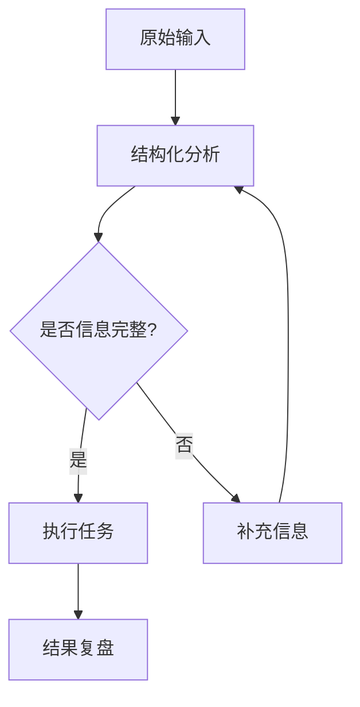
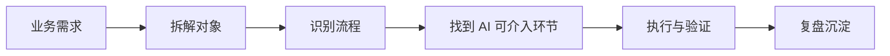
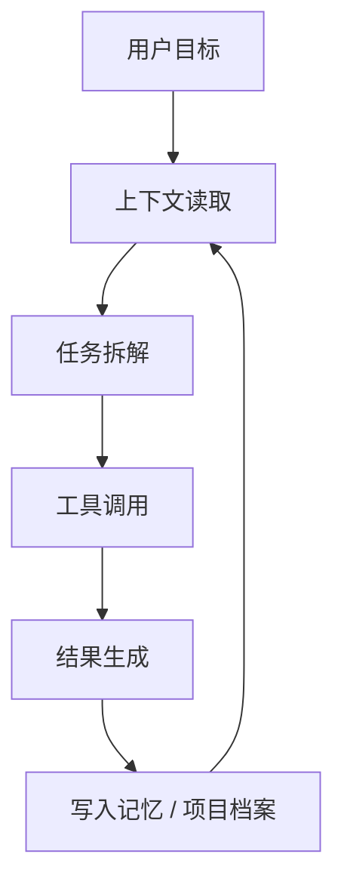
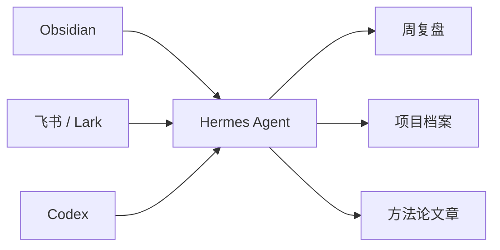

# Mermaid 图例写作规范

用于博客、项目档案、工具笔记和方法论文章。目标不是为了炫图，而是让读者更快理解你的业务判断、Agent 工作流和项目结构。

## 什么时候该放图

- 文章里出现 3 个以上步骤：用 `flowchart`。
- 涉及多个角色或工具协作：用 `sequenceDiagram`。
- 想表达项目模块关系：用 `flowchart LR` 或 `graph TD`。
- 想表达状态变化：用 `stateDiagram-v2`。
- 只是列清单、观点或总结：不要强行画图。

## 推荐写法

先用一句话告诉读者这张图要看什么，再放 Mermaid，图后再写一句结论。

````md
下面这张图只看一件事：用户输入不是直接进入结果，而是先经过结构化分析，再进入可控生成流程。



这说明这个流程的核心不是“自动生成”，而是先把不可控输入变成可执行结构。
````

## 职业博客里的常用图

### 业务流程图



### Agent 工作流图



### 工具协作图



## 写图原则

- 一张图只表达一个判断。
- 节点名称尽量短，超过 12 个中文字就拆成两个节点。
- 不把隐私路径、客户名称、内部配置写进图里。
- 图前说明“怎么看”，图后写“所以什么”。
- 如果图太复杂，拆成两张：流程图 + 模块图。
