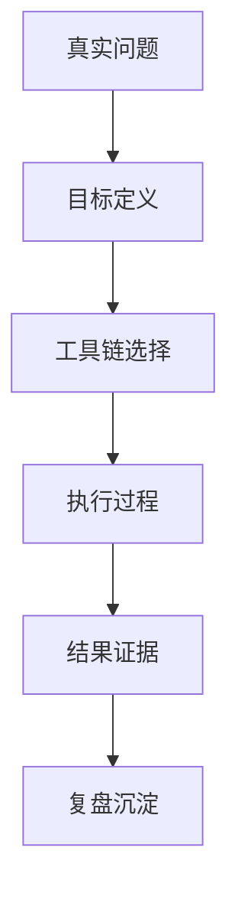

# 项目名称：一句话说明

## 项目背景

这个项目是在什么业务/学习/工作场景里出现的？

## 真实问题

- 表面问题：
- 深层问题：
- 如果不解决，会造成什么影响？

## 目标

| 目标 | 验收方式 |
| ---- | -------- |
|  |  |

## 工具链

- Agent / AI：
- 知识库：
- 自动化：
- 协作工具：
- 部署 / 工程：

## 执行过程

1. 
2. 
3. 

## 项目流程图（可选）

> 用 Mermaid 画出项目从问题到结果的关键路径，避免只写“我做了什么”，要让读者看到你的拆解方式。

## 结果证据

- 可公开结果：
- 可展示材料：
- 数据或反馈：

## 复盘

### 做对了什么

- 

### 踩了什么坑

- 

### 下次怎么改

- 

## 可迁移方法

这个项目里，哪些方法可以迁移到下一个项目？
