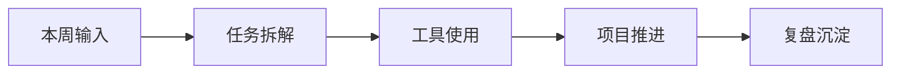

# YYYY-WNN：本周 AI 提效复盘

## 本周一句话

> 这一周最重要的判断是什么？

## 本周做了什么

| 方向 | 具体动作 | 结果 |
| ---- | -------- | ---- |
| 项目推进 |  |  |
| 工具使用 |  |  |
| 业务理解 |  |  |
| 内容沉淀 |  |  |

## 业务理解

- 我这周更理解了哪个业务问题？
- 这个问题里，真正影响结果的变量是什么？
- 哪些环节适合 AI 介入，哪些暂时不适合？

## 工具使用

- 本周主要用了哪些工具？
- 哪个工具真正节省了时间？
- 哪个工具还只是看起来有用？

## 项目推进

- 项目当前处于什么阶段？
- 这周推进了什么可验证成果？
- 还卡在哪里？

## 可视化图例（可选）

> 如果这周有流程、工具协作或 Agent 工作流值得沉淀，可以放一张 Mermaid 图。图前写“这张图要看什么”，图后写“所以我的判断是什么”。

## 核心收获

1. 
2. 
3. 

## 下周动作

- [ ] 
- [ ] 
- [ ] 

## 可沉淀成项目/方法论的内容

- 可以抽成项目档案：
- 可以抽成方法论：
- 可以后续写成工具文章：
