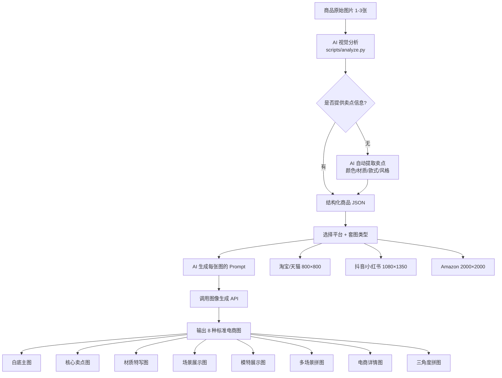

## 核心结论

这个仓库（[wzj177/ecommerce-image-suite](https://github.com/wzj177/ecommerce-image-suite)，⭐ 124）解决的是一个具体问题：**电商卖家上传一张商品图，能不能一键生成淘宝/抖音/亚马逊全套主图？**

答案是：能，但不能全自动。

---

## 这个工具做什么

整个 workflow 分三层：



**标准套图 8 种**，覆盖服饰、电器等多个品类。

---

## 技术架构：三层分离

| 层级 | 模块 | 说明 |
|------|------|------|
| 分析层 | `analyze.py` | 视觉识别，输出结构化 JSON |
| 生成层 | `generate.py` | Prompt 组织 + 调用图像 API |
| 供应商层 | `check_providers.py` | API Key 检测与路由 |

供应商支持国产直连（通义千问、豆包），也支持 OpenAI/Gemini/Stability AI。

```bash
# 分析商品图
python3 scripts/analyze.py --image product.jpg

# 生成套图
python3 scripts/generate.py \
  --product 'json字符串' \
  --provider tongyi \
  --lang zh \
  --types white_bg,key_features,selling_pt,material,lifestyle,model,multi_scene
```

---

## 我怎么看

**有价值的部分：**

1. **Prompt 模板库** — 这是最实用的东西。按平台（淘宝/抖音/Amazon）、按图型（卖点图/材质图/模特图）预设了 Prompt 模板，不需要每次自己调。
2. **供应商路由** — 一个脚本切换通义/豆包/OpenAI，开发者友好。
3. **8 种标准图型** — 基本覆盖了电商卖家的主图需求。

**局限性：**

1. **AI 模特质量不稳定** — SKILL.md 里专门有一个「第四步半」处理模特生成，两阶段确认机制（生成模特 → 用户确认 → 锁定 → 生成其余图）。这说明当前 AI 模特还没法一次性做好，需要人工介入。
2. **不是真正「一键」** — 上传图片之后，系统需要用户选择平台、图型、模板风格，不是上传即输出。
3. **服装品类最成熟，电器/食品次之** — 从样例分布看，服饰类案例最丰富（男装/女装/童装多组），电器只有 1 组，食品/其他品类没有覆盖。

---

## 谁适合用

| 场景 | 推荐程度 | 原因 |
|------|---------|------|
| 淘宝/抖音服装卖家 | ⭐⭐⭐⭐ | 模板最全，AI 模特+多场景是强需求 |
| Amazon 跨境卖家 | ⭐⭐⭐ | 支持英文输出，但模特生成需测试 |
| 独立站/Shopify | ⭐⭐⭐ | 支持 2000×2000 或 16:9，灵活性高 |
| 电器/食品卖家 | ⭐⭐ | 套图模板较少，场景图生成效果待验证 |

---

## 和我之前踩坑的对比

昨天我在研究抖音生图的时候，测试了 ChatGPT 生成商品详情页套图，发现**可控性不够** — 输出的图型和构图没法精准控制，只能大概接近需求。

这个工具的思路不一样：它不是让 AI 自由发挥，而是**先提取商品信息，再按固定模板生成**。相当于把 Prompt 工程封装成了可配置的工作流。

理论上，这样生成的结果一致性更高。但具体效果还是要看AI 图像模型的能力上限。

---

## 总结

这个仓库适合**不想每次都为电商主图付设计费**的卖家。工具本身设计合理，分层清晰，供应商路由做得好。最大的局限是 AI 模特和场景图的质量——这部分取决于图像生成模型本身的能力，不是这个 Skill 能解决的。

如果你在找电商主图生成的 Prompt 模板库，这个仓库值得研究。如果你想全自动生成高质量电商图，现在还没到那个程度。

---

**关联项目：**
- [AstroPaper](https://github.com/sartajdev/AstroPaper) — 本博客基于此主题
- [OpenClaw](https://github.com/nv-coyafky/openclaw-hackathon) — Coya 的 Agent 框架实验