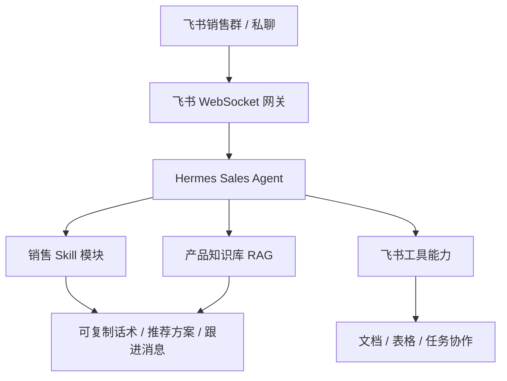

# Hermes 云部署 Sales Agent：面向公司销售场景的 AI 业务助手

## 项目一句话

这是一个把 Hermes Agent 部署到公司销售场景里的项目。它通过飞书机器人接入团队日常沟通，再用销售 Skill、产品知识库和权限规则，把客户咨询、产品推荐、异议处理、售后提醒和跟进消息变成可复用的 Agent 能力。

公开边界：这篇文章只记录架构、方法和可公开的项目能力，不展开内部配置、客户数据、价格细节、服务器地址或私密业务资料。

## 为什么要做

销售和客服场景里，很多问题不是“有没有 AI 回复”这么简单，而是：

- 新同事需要快速理解产品、话术和服务边界。
- 客户问题经常横跨价格、效果、风险、质保和竞品对比。
- 销售跟进需要及时、自然、可复制，而不是每次从零组织语言。
- 团队知识如果只停留在文档里，很难进入真实对话现场。

所以这个项目的核心不是做一个聊天机器人，而是把公司销售流程拆成可调用的模块，让 Agent 能在飞书里帮助团队处理真实业务问题。

## 架构概览

这个架构里，飞书负责入口，Hermes 负责 Agent 行为和上下文，Skill 负责销售方法论，知识库负责产品事实，飞书工具能力负责协作动作。

## 能力拆解

### 1. 飞书入口与权限边界

Agent 以飞书机器人身份进入团队工作流。它支持群聊提及和私聊使用，并通过配对、白名单、机器人权限和用户授权来控制可访问范围。

我认为这个边界很重要：企业 Agent 不应该默认“什么都能做”，而应该把读取、创建、修改、删除等操作拆开，并在写操作前保持预览和确认。

### 2. 销售 Skill 模块

这个项目把销售过程拆成模块化 Skill，例如获客咨询、需求诊断、客户教育、产品推荐、异议处理、谈判推进、到店接待、成交推进、售后关怀、话术润色和跟进消息。

这些模块背后的方法并不是随意写话术，而是把 The Mom Test、SPIN Selling、They Ask, You Answer、Never Split the Difference、Influence 等销售和沟通方法整理成可调用的 Agent 工作流。

### 3. 产品知识库

产品信息使用结构化 JSONL 知识库管理，记录企业介绍、隐形车衣、窗膜、改色膜入口、售后养护 SOP 和价格政策脚本等内容。

对销售场景来说，知识库的价值不是“资料更多”，而是让 Agent 在回答具体参数、推荐产品或解释服务边界时有来源、有约束，减少凭空编造。

### 4. Always-Active 行为准则

除了被动调用 Skill，Agent 还需要一组始终生效的行为准则：角色定位、语言风格、推荐流程、信息边界和售后原则。

这部分决定了 Agent 在没有明确调用某个模块时，仍然能保持稳定语气和业务边界。

## 当前公开成果

- 建立了独立的 Hermes Sales Agent Profile。
- 整理了面向销售全流程的模块化 Skill 系统。
- 建立了结构化产品知识库，用于检索和引用。
- 准备了 Profile 打包、知识库校验和云端部署说明。
- 形成了面向飞书团队协作的 Agent 接入方案。

项目仓库：[hermes-cloud-deployment](https://github.com/coyafky/hermes-cloud-deployment)

架构说明：[Hermes Sales Agent — 内部销售助手说明](https://github.com/coyafky/hermes-cloud-deployment/blob/main/docs/sales-agent-introduction.md)

## 我在这个项目里学到的

第一，企业 Agent 的关键不是“接上大模型”，而是把业务流程拆成清楚的入口、模块、知识和权限。

第二，销售 Agent 不能只追求流畅输出，还要追求可信边界：什么时候能推荐、什么时候要追问、什么时候不能承诺、什么时候必须引用资料。

第三，项目档案最好同时保留两种证据：一类是代码和部署资产，另一类是业务流程和方法论说明。前者证明能做出来，后者证明知道为什么这样做。

## 可以写进简历的表达

- 设计并整理面向车膜销售场景的 Hermes 云部署 Sales Agent，覆盖飞书入口、销售 Skill、结构化产品知识库和权限边界。
- 将销售咨询、需求诊断、产品推荐、异议处理、跟进消息等流程拆成模块化 Agent 能力，提升团队知识复用效率。
- 建立 JSONL 产品知识库和行为准则，约束 Agent 在推荐、参数说明和服务承诺中的事实来源与表达边界。

## 下一步

- 继续完善知识库校验，减少产品参数和服务边界的不一致。
- 在真实销售群里小范围试运行，收集高频问题和失败案例。
- 把更多业务动作沉淀成可复用 Skill，例如客户分层、线索跟进、售后回访和成交复盘。
