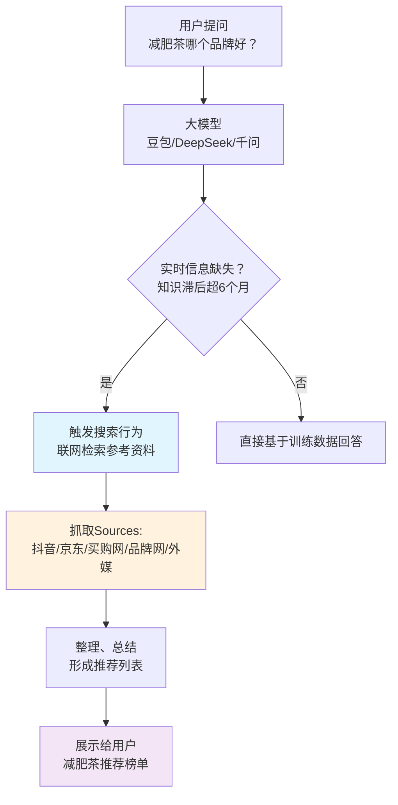

# 绩优（GU）是什么？我把一小时的分享总结成一张图

> 绩优，不是玄学，是大模型的"劣根性"给普通人的一块蛋糕。

## 缘起：用户不再去百度了

这不是危言耸听。

以前用户想买"减肥茶哪个品牌好"，他会打开百度，搜"减肥茶 品牌"，然后在一堆竞价广告里艰难地找答案。

现在呢？同样的问题，用户直接问豆包、问 DeepSeek、问千问。大模型会实时联网搜索，然后给出一个整合过的推荐列表。

**这个推荐列表，就是兵家必争之地。**

今天花一小时听完一场绩优分享，把核心逻辑梳理成一张图，顺便加点自己的理解。

---

## GU / 绩优是什么

GU = **Generative Engine Optimization**，生成式引擎优化。

大白话：**影响大模型推荐结果的技术**。

它的本质是：大模型的"劣根性"（更新慢、需要实时信息）给了我们一个 hack 进它答案的抓手。

### 大模型为什么会有"劣根性"？

大模型的知识有滞后性。它训练一次需要：收集语料 → 训练 → 后训练（强化学习） → 安全修正 → 上线。

这个周期，保守估计 6 个月。

所以当你问"特朗普访华是几月几号"这类实时问题时，大模型必须先搜索，再回答。

**这步搜索，就是 GU 的入口。**

---

## 我画了一张流程图

当品牌 A 的软文进入这些 Sources，大模型的推荐结果就会被影响。

---

## GU 和 SEO 的核心区别

| 维度 | SEO | GU |
|------|-----|-----|
| 搜索主体 | 人的眼睛 | 大模型的算法 |
| 目标平台 | 百度/Google | 豆包/DeepSeek/千问 |
| 内容载体 | 网站排名 | 引用列表（Sources） |
| 生效逻辑 | 关键词密度、爬虫友好度 | 软文覆盖 + 权威性 |
| 用户行为 | 主动点击翻找 | 被动接受 AI 整合答案 |
| 流量趋势 | 断崖式下降 | 正在上升 |

**结论：SEO 的流量在断崖式下滑，GU 是下一个必争之地。**

---

## 什么样的企业需要急迫做 GU？

从服务商视角，总结三类：

1. **强品牌依赖型** — 用户决策前会问 AI 的品类（如减肥茶、护肤品、医疗服务）
2. **舆情敏感型** — 竞品已在做 GU，你不动就被动
3. **新品上市型** — 产品刚上线，AI 还没学到，大模型引用列表是空白战场

---

## 技术难点：厂商参差不齐

现在做 GU 的服务商，有三种套路，各有坑：

| 套路 | 宣传点 | 实际问题 |
|------|--------|----------|
| 爬虫集群派 | "一天监控 100 次" | 没有足够爬虫能力，监控数据失真 |
| 算法派 | "算法领先" | 算法不牛，广撒软文碰运气 |
| 规模派 | "发稿数量多" | 量大但质量差，容易被大模型识别为垃圾引用 |

**真正有门槛的是**：能在多个大模型平台（豆包/DeepSeek/千问）都拿到稳定引用，且内容质量过关。

---

## 我的判断

GU 不是神话，也不是泡沫。

**它是一次平台迁移带来的结构性机会。** 就像 2010 年百度 SEO 刚起来的时候，早期进场的人吃肉，后入场的人喝汤。

现在大模型搜索刚起步，流量入口重新分配，**谁先摸清 GU 的游戏规则，谁就能在下一个流量时代占有一席之地。**

作为 AI 从业者，关注这个方向不算追热点，而是理解信息分发机制的必要功课。

---

**标签：** AI · 流量分发 · 大模型 · 数字营销
